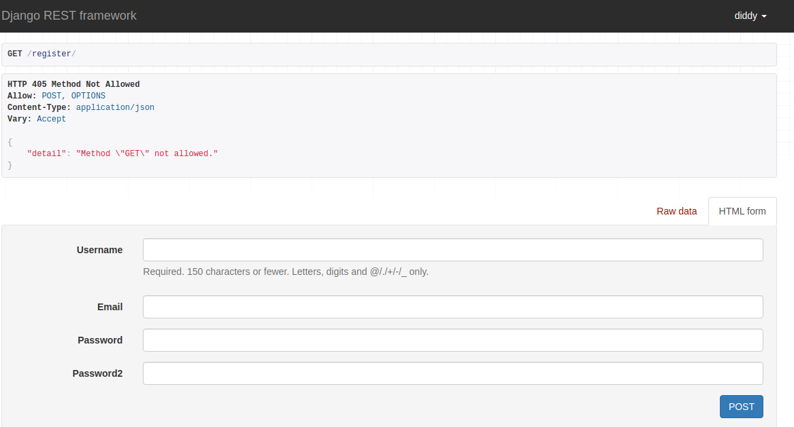
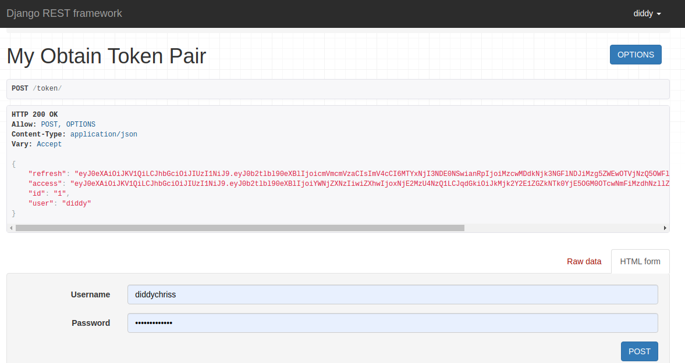
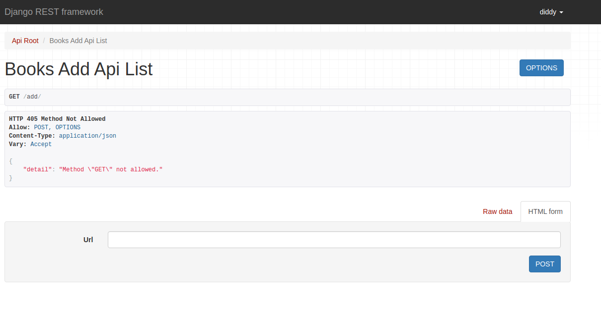
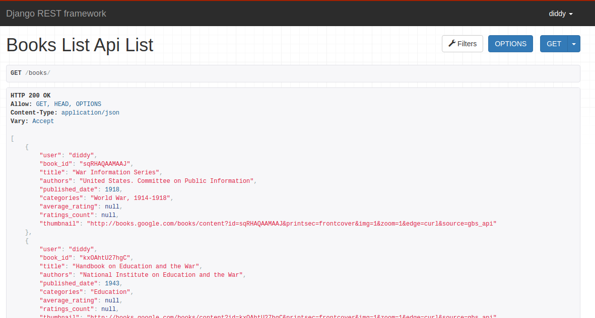
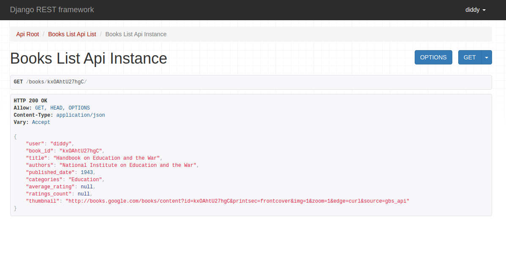
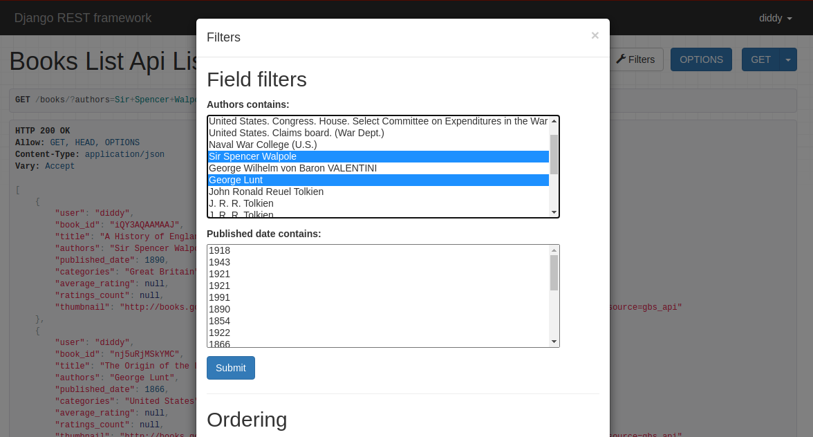
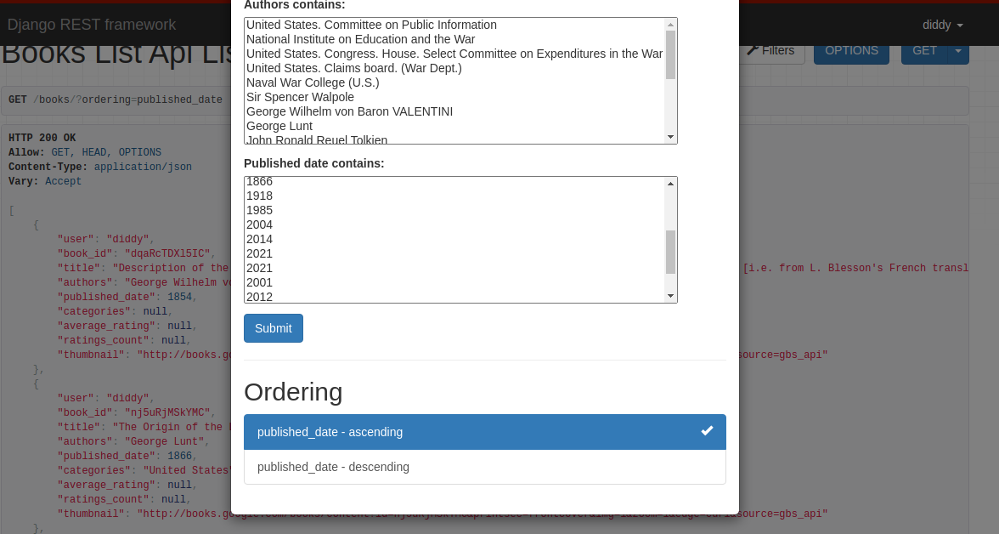

# BooksApp
> Django-REST-framework App 
## Table of contents
* [General info](#general-info)
* [Technologies](#technologies)
* [Initial Setup](#initial-setup)  
* [Instruction](#instructions)
* [Live View](#live-view)
* [Status](#status)
* [Contact](#contact)

## General info
> BooksApp - App for get some json movies data from specific url 

## Technologies
* Python - version 3.8
* Python Django -  3.0
* Django REST Framework 3.12.2
* PostgreSQL
* Docker

## Initial Setup
#### git clone repository "https://github.com/DiddyChriss/GeoApp.git"
#### Use Docker
#### Ask me for .env file
#### "python3 manage.py createsuperuser" so you can manage Django Api UI, register as API user

## Instructions
#### Login as superuser or create api user | url */register/

#### Add some books data by post "https://www.googleapis.com/books/v1/volumes?q=Hobbit" or update books " https://www.googleapis.com/books/v1/volumes?q=war"

#### Get list of books on /books/

#### Get some detail by book_id /books/nj5uRjMSkYMC/

#### Filter Authors /books/?authors=George Lunt&authors=Chuck Dixon/  or  by published_date   /books/?published_date=1943/

#### Also you can ordering by published_date /books/?ordering=published_date/

#### Have fun!!!

## Live View
Live view available on (https://books-app-diddy.herokuapp.com/) 

## Status
Finish!

## Contact
Created by [DiddyChriss] (http://chriss.pythonanywhere.com/) - feel free to contact me!
